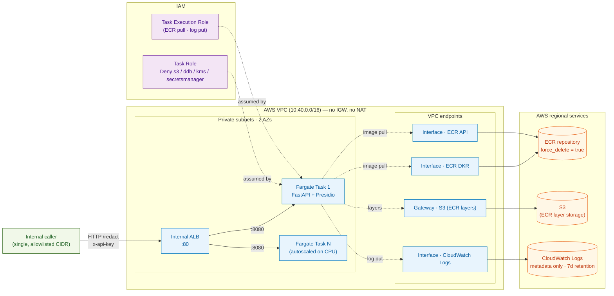
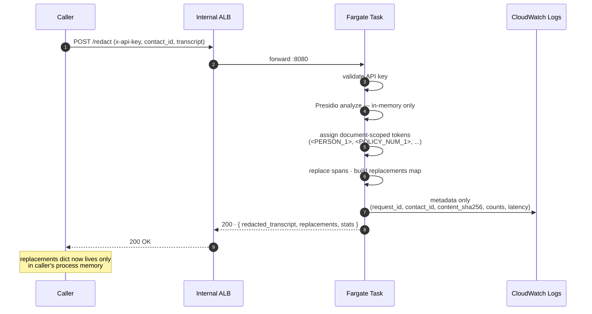
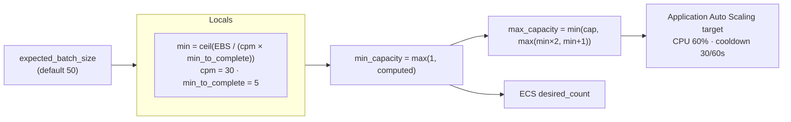
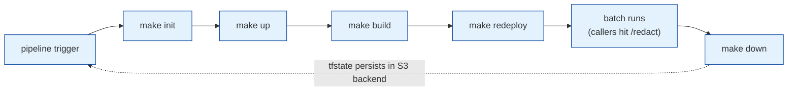

# PII Service — Architecture Diagram

Visual companion to `infra/pii/README.md` (operator) and
`docs/pii-api.md` (consumer). Diagrams render inline on GitHub.

## Components and connections

## Request flow

## Explicitly absent (by design)

These are *not* part of the stack, and the task IAM role denies the APIs
that would create them:

- **No DynamoDB / RDS / S3 PII vault.** Replacements travel only in the
  HTTP response.
- **No KMS CMK** — there is nothing at rest to encrypt.
- **No Secrets Manager** — the API key is injected at deploy time as a
  task environment variable; teardown leaves no recovery-window state.
- **No NAT gateway, no internet gateway.** Tasks reach AWS APIs solely
  via VPC endpoints; no path to the public internet.
- **No /rehydrate endpoint.** If the caller drops the dict, the value is
  unrecoverable from this stack.

## Capacity (defaults)

For the default `expected_batch_size = 50` this resolves to
`min = 1, max = 2`. Increase `expected_batch_size` per pipeline run when a
larger batch is staged; the next `make up` re-applies cleanly.

## Lifecycle

`terraform destroy` removes the VPC, ALB, ECS cluster + service, ECR
(with images via `force_delete`), VPC endpoints, IAM roles, log group,
and autoscaling target. The Terraform state bucket and lock table live
outside this stack and are intentionally not in scope for teardown.
